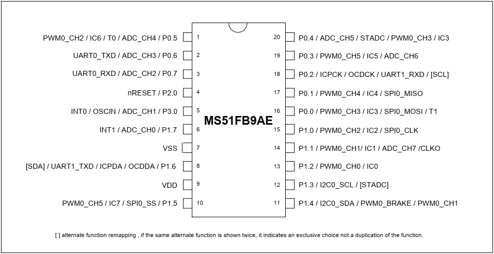
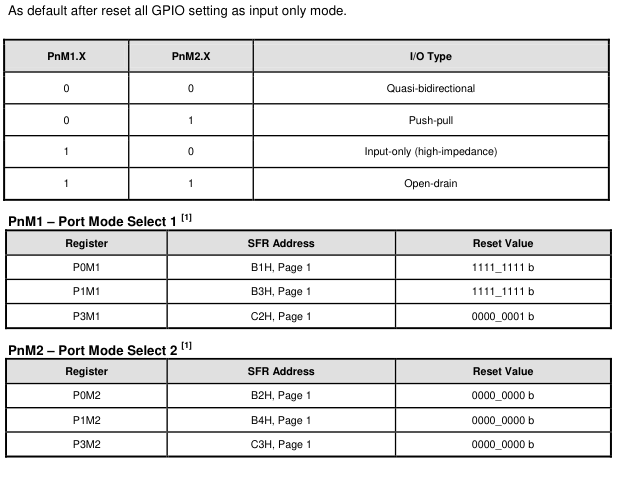
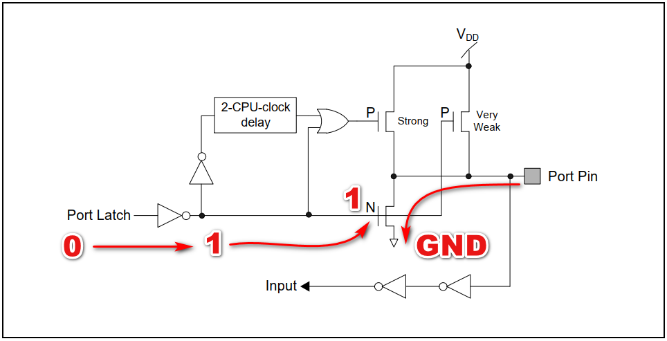
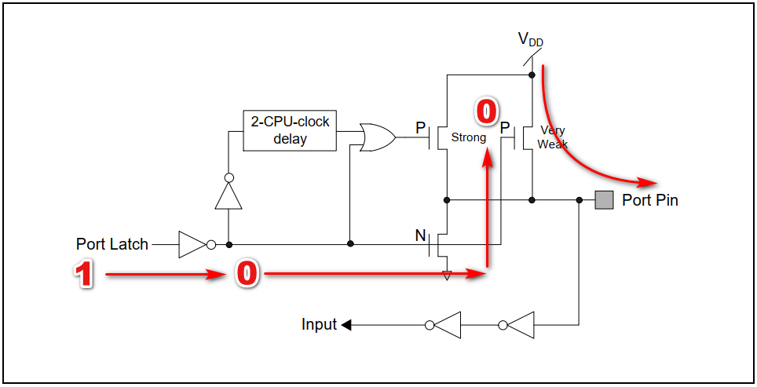
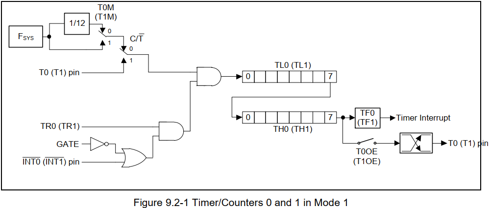

# Giới thiệu về vi điều khiển MS51FB9AE

- Con **N76E003AT20** là sản phẩm có trước, sau này được thay thế bằng con **MS51FB9AE**.

>   Ở đây mình viết về con MS51 vì nó mới hơn nhưng đối với con N76E003 cũng y hệt như vậy. Thậm chí con N76E003 và con MS51 thì con MS51 còn có thể dùng chung file HEX mà không cần dịch lại.

- CPU 8051: tần số hoạt động tối đa 24MHz (đối với N76E003 tối đa là 16MHz).
- Dải điện áp hoạt động từ 2.4V đến 5.5V.
- Nhiệt độ hoạt động -40 đến 105 độ C.
- Bộ nhớ Flash 16KB (đối với N76E003 là 18KB).
- RAM 256 byte + 1KB XRAM (đối với N76E003 là 256 Byte + 768 Byte XRAM).
- Chân vào ra: 18 chân trong đó 17 chân GPIO và 1 chân chỉ có thể cấu hình đầu vào.
- Timer: 16 bit Timer 0 và Timer 1 tương thích với 8051.
- 16 bit Timer 2: với 3 kênh Input Capture.
- Timer 3: 16 bit Auto reload có thể được sử dụng tạo baud rate cho UART.
- PWM 16 bit.
- 2 bộ UART: UART0 và UART1, chân TxD và RxD của UART có thể cấu hình đổi cho nhau.
- SPI: tối đa 8Mbps.
- I2C tối đa 400Kbps
- ADC 12 bit tốc độ tối đa 500Ksps
- Sơ đồ chân:

Datasheet và Reference Manual ở trong thư mục Hoc MS51FB9AE

## 1.GPIO 
Các chân có thể cấu hình ở 4 chế độ:

|0  |0  |Quasi-bidirectional            |
|:-|:-|:-|
|0  |1  |Push-pull                      |
|1  |0  |Input-only (high-impedance)    |
|1  |1  |Open-drain                     |

**1. Chế độ Quasi:**
- Theo như mình tìm hiểu trong datasheet Quasi là chế độ gần như hai chiều, nó là cấu trúc I/O tiêu chuẩn của 8051, có thể điều khiển cả đầu vào và đầu ra. Khi cổng xuất ra mức logic cao, nó được điều khiển yếu, cho phép thiết bị bên ngoài kéo chân xuống mức thấp. có nghĩa nó chỉ có thể cung cấp một lượng dòng điện nhỏ và một thiết bị bên ngoài có thể kéo nó xuống thấp mà không tốn nhiều công sức và không làm hỏng chân. Khi chốt được kéo xuống thấp, nó được dẫn động mạnh và có thể nhấn chìm một dòng điện lớn. 
Hoạt động ghi giá trị 0 1 như sau:

Ngoài ra có các chế độ Push-pull, Input and Open-drain cho giao tiếp I2C. Chế độ Open-drain cần điện trở kéo lên bên ngoài.
[Tham khảo](http://vidieukhien.org/ms51fb9ae-gpio.html)

## 2. Timer 0 và 1

**1. Mode 0 (13-Bit Timer) và Mode 1 (16-Bit Timer)**
Chế độ 0 và chế độ 1 hoạt động rất giống nhau chỉ khác nhau về số bit.

Như datasheet mô tả thì xung hệ thống Fsys được chọn qua bit T0M(T1M)
- Nếu T0M = 0 thì xung đầu vào bằng xung hệ thống Fsys / 12
- Nếu T1M = 1 thì xung đầu vào sẽ bằng xung hệ thống Fsys 
Tiếp theo bit C/T nếu bằng 0 thì timer dùng xung clock hệ thống. Còn bằng 1 thì sẽ đếm xung từ chân T0 khi có một nguồn clock đặt tại chân T0
**Bit TR0 = 1 thì Timer 0 sẽ đếm, ngược lại sẽ dừng Timer 0**

**Cái phần này cần coi lại giữa code tham khảo từ anh cường, anh cường sử dụng mode2 cho hàm delay** 

## I2C

