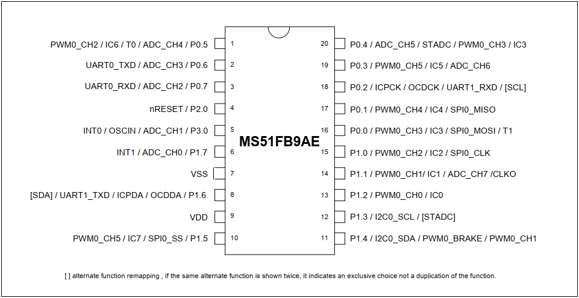
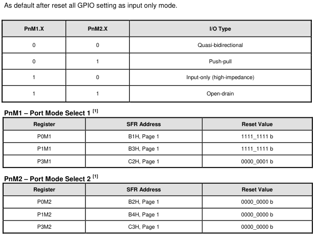
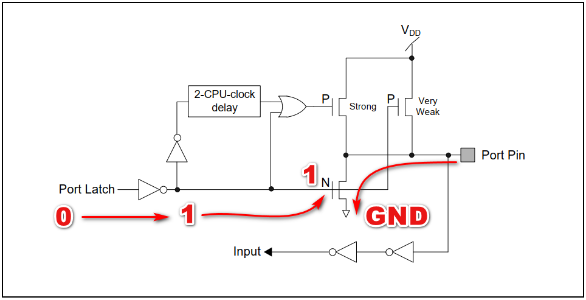
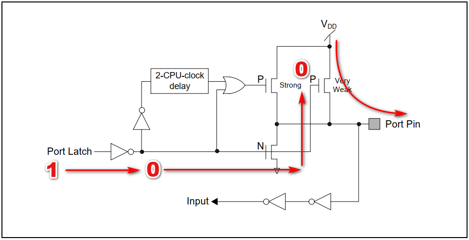
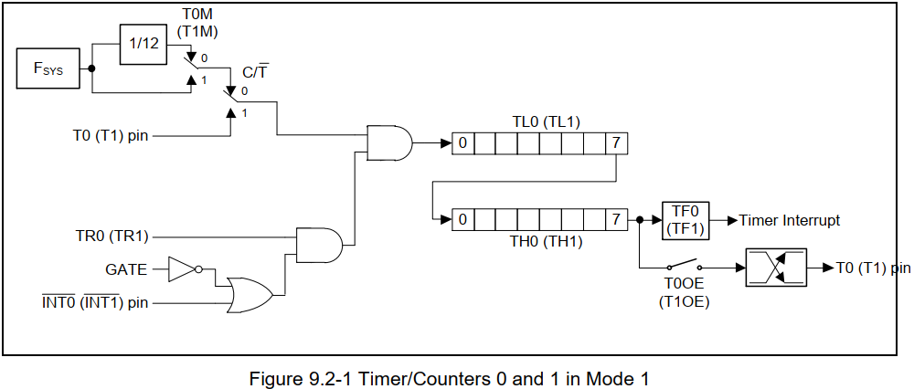

# Giới thiệu về vi điều khiển MS51FB9AE


- Con **N76E003AT20** là sản phẩm có trước, sau này được thay thế bằng con **MS51FB9AE**. **N76E003** là vi điều khiển họ 8051 1T hiệu suất cao, hoàn toàn tương thích với tiêu chuẩn 80C51 của hãng Nuvoton. VĐK có bộ nhớ flash ROM lên đến 18K Bytes, có thể cấu hình bộ nhớ data flash và hỗ trợ IAP; làm việc dưới mức điện áp rộng 2.4- 5.5V; chống nhiễu cao (7KV ESD, 4KV EFT); ngoài ra còn tích hợp 3 nguồn xung clock: clock nội tốc độ thấp 10KHz, clock nội tốc độ cao 16MHz ± 1% (VDD=5V), ±2% (điều kiện khác) và clock ngoại.

>   Ở đây mình viết về con MS51 vì nó mới hơn nhưng đối với con N76E003 cũng y hệt như vậy. Thậm chí con N76E003 và con MS51 thì con MS51 còn có thể dùng chung file HEX mà không cần dịch lại.


- CPU 8051: tần số hoạt động tối đa 24MHz (đối với N76E003 tối đa là 16MHz).
- Dải điện áp hoạt động từ 2.4V đến 5.5V.
- Nhiệt độ hoạt động -40 đến 105 độ C.
- Bộ nhớ Flash 16KB (đối với N76E003 là 18KB).
- RAM 256 byte + 1KB XRAM (đối với N76E003 là 256 Byte + 768 Byte XRAM).
- Chân vào ra: 18 chân trong đó 17 chân GPIO và 1 chân chỉ có thể cấu hình đầu vào.
- Timer: 16 bit Timer 0 và Timer 1 tương thích với 8051.
- 16 bit Timer 2: với 3 kênh Input Capture.
- Timer 3: 16 bit Auto reload có thể được sử dụng tạo baud rate cho UART.
- PWM 16 bit.
- 2 bộ UART: UART0 và UART1, chân TxD và RxD của UART có thể cấu hình đổi cho nhau.
- SPI: tối đa 8Mbps.
- I2C tối đa 400Kbps
- ADC 12 bit tốc độ tối đa 500Ksps

> **Sơ đồ chân:**


## Tài nguyên phát triển

1. Datasheet: [Tải tại đây](https://www.nuvoton.com/products/microcontrollers/8bit-8051-mcus/industrial-8051-series/ms51fb9ae/?group=Document&tab=2)
2. Trình biên dịch KeilC: [Tải tại đây](https://www.keil.com/c51/demo/eval/c51.htm)
3. KeilC driver dành cho 8051 Nuvoton (thấp nhất là phiên bản 2.0):[tải tại đây](https://www.nuvoton.com/products/microcontrollers/8bit-8051-mcus/low-power-touch-key-ml56-series/index.html?__locale=en&resourcePage=Y&category=%2f_categories%2fsupport%2ftool-and-software%2fsoftware%2f&pageIndex=2)
4. Chương trình nạp: “NuMicro ICP Programming Tool (V2.01.6592)”: [tải tại đây](https://www.nuvoton.com/products/microcontrollers/8bit-8051-mcus/industrial-8051-series/ms51fb9ae/?group=Software&tab=2)

## Mạch phát triển:
Mạch ra chân đơn giản, chưa có LED tại chân P1.5(sẽ cập nhật sau)


## Example

### 1. GPIO 
Các chân có thể cấu hình ở 4 chế độ:


|PnM1.X|PnM2.X   |  |
|:-|:-|:-|
|0  |0  |Quasi-bidirectional            |
|0  |1  |Push-pull                      |
|1  |0  |Input-only (high-impedance)    |
|1  |1  |Open-drain                     |

**a. Chế độ Quasi:**
- Theo như mình tìm hiểu trong datasheet Quasi là chế độ gần như hai chiều, nó là cấu trúc I/O tiêu chuẩn của 8051, có thể điều khiển cả đầu vào và đầu ra. Khi cổng xuất ra mức logic cao, nó| được điều khiển yếu, cho phép thiết bị bên ngoài kéo chân xuống mức thấp. có nghĩa nó chỉ có thể cung cấp một lượng dòng điện nhỏ và một thiết bị bên ngoài có thể kéo nó xuống thấp mà không tốn nhiều công sức và không làm hỏng chân. Khi chốt được kéo xuống thấp, nó được dẫn động mạnh và có thể nhấn chìm một dòng điện lớn. 
Hoạt động ghi giá trị 0 1 như sau:



Ngoài ra có các chế độ Push-pull, Input and Open-drain cho giao tiếp I2C. Chế độ Open-drain cần điện trở kéo lên bên ngoài.
[Tham khảo thêm tại đây](http://vidieukhien.org/ms51fb9ae-gpio.html)

### 2. Timer 0 và 1
**a. Mode 0 (13-Bit Timer) và Mode 1 (16-Bit Timer)**
Chế độ 0 và chế độ 1 hoạt động rất giống nhau chỉ khác nhau về số bit.



Như datasheet mô tả thì xung hệ thống Fsys được chọn qua bit T0M(hoặc T1M)
- Nếu **T0M (hoặc T1M) = 0** thì xung đầu vào bằng xung hệ thống Fsys / 12
- Nếu **T1M (hoặc T1M) = 1** thì xung đầu vào sẽ bằng xung hệ thống Fsys 
Tiếp theo bit C/T nếu bằng 0 thì timer dùng xung clock hệ thống. Còn bằng 1 thì sẽ đếm xung từ chân T0 khi có một nguồn clock đặt tại chân T0
- **Bit TR0 = 1 thì Timer 0 sẽ đếm, ngược lại sẽ dừng Timer 0**

<span style="color: red"> Hàm khởi tạo Timer0: 

> Thanh ghi **TMOD**:

|TMOD||||||||
|:-     |:-     |:-     |:-     |:-     |:-     |:-     |:- |
|7      |6      |5      |4      |3      |2      |1      |0  |
|GATE   |C/T̅    |M1     |M0     |GATE   |C/T̅    |M1     |M0 |

**M1**  |**M0** |**Timer 0 Mode**|
:-      |:-     |:-     |
0       |0      |Mode 0: 13-bit Timer/Counter|
0       |1      |Mode 1: 16-bit Timer/Counter|
1       |0      |Mode 2: 8-bit Timer/Counter with auto-reload from TH0|
1       |1      |Mode 3: TL0 as a 8-bit Timer/Counter and TH0 as a 8-bit Timer|

> Thanh ghi **CKCON – Clock Control**

|CKCON||||||||
|:-     |:-     |:-     |:-     |:-     |:-     |:-     |:- |
|7      |6      |5      |4      |3      |2      |1      |0  |
|FASTWK |PWMCKS |T1OE   |T1M    |T0M    |T0OE   |CLOEN  | x |


```c
void Delay_Init(void)
{
    /*Using Mode1 */
    TMOD |= (1 << 0);
    TMOD &= ~(1 << 1);
    /*Choose Ftimer = Fsys = 16mhz*/
    CKCON |= (1 << 3);

    TMOD &= ~(1 << 2);
    TMOD &= ~(1 << 3);
}
```

- Hàm delay 1ms dùng Timer0:

```c
void delay_1ms(void)
{
    TH0 = 0;
    TL0 = 0;
    TR0 = 1;	/*Timer 0 Enable*/
    while (TH0 * 256 + TL0 < 16000) {
    }
    TR0 = 0;	/*Stop Timer0 and the current count will be preserved in TH0,TL0*/
}
```

## 3. I2C

```c

void I2C_Init(void)
{
	I2CLK = 39;
	/* P1.3 */
	/* Quasi */
	P1M1 &= ~(1 << 3);
	P1M2 &= ~(1 << 3);
	/* P1.4 */
	/* Quasi */
	P1M1 &= ~(1 << 4);
	P1M2 &= ~(1 << 4);
	
	P13=1;
	P14=1;
	
	I2CEN=1;
}

#define timeout 1000
uint8_t I2C_start(void)
{
	/*Bus Released : As default, Status “0xF8” exists in both master/slave modes  */
	if (I2STAT != 0xF8) {
		return 0;
	}
	/* start */
	STO = 0;
	STA = 1;
	SI = 0;
	while (!SI);
	if (I2STAT != 0x08) {
		/* start error */
		send_stop();
		return 0;
	}
}
uint8_t I2C_RepeatedStart(void)
{	/* Repeated START */
	STO = 0;
	STA = 1;
	SI = 0;
	while (!SI);
	/*Master Repeat Start*/
	if (I2STAT != 0x10) { 
		/* start error */
		send_stop();
		return 0;
	}
}
uint8_t send_stop(void)
{
	uint16_t t;
	uint8_t u8TimeOut;
	
	STA = 0;
	STO = 1;
	SI = 0;
	t = 1;
	u8TimeOut = 0;
	while (1) {
		if (I2STAT == 0xF8) {
			break;
		}
		if (!t) {
			u8TimeOut = 1;
			break;
		}
		++t;
	}
	return (!u8TimeOut);
}
uint8_t I2C_Address(uint8_t Address, uint8_t WriteRead){
	uint8_t i;
	uint16_t t;

	/* send address */
	STA = 0;
	STO = 0;
	I2DAT = Address;
	SI = 0;
	while (!SI);
	if(WriteRead)	/*Read*/
	{
		/*40H, Master Receive Address ACK*/
		if (I2STAT != 0x40) {
			/* send address error */
			send_stop();
			return 0;
		}

	}
	else	/*Write*/
	{
		/*18H,Master Transmit Address ACK, SLA+W transmitted, ACK received*/
		if (I2STAT != 0x18) {
			/* send address error */
			send_stop();
			return 0;
		}
	}
}

uint8_t I2C_Write(uint8_t u8Data)
{
	/* send data */
	I2DAT = u8Data;
	SI = 0;
 	while (!SI);
		/*28H, Data byte in S1DAT has been transmitted, ACK received*/
		if (I2STAT != 0x28) {
			/* send data error */
			send_stop();
			return 0;
		}
}

uint8_t I2C_Write_nByte(uint8_t *pData, uint8_t length)
{
	uint8_t i;
	/* send data */
	for (i = 0; i < length; ++i) {
		I2DAT = pData[i];
		SI = 0;
		while (!SI);
		if (I2STAT != 0x28) {
			/* send data error */
			send_stop();
			return 0;
		}
	}
}
uint8_t I2C_Read(uint8_t AckNack) /*1:Ack, 0: Nack*/
{
	uint8_t u8Data;
	if(AckNack)
	{
		AA = 1;
		SI = 0;
		while (!SI);
		if (I2STAT != 0x50) { /*Master Receive Data ACK*/
			/* send data error */
			send_stop();
			return 0;
		}
		u8Data = I2DAT;
		return u8Data;
	}
	else 
	{
		AA = 0;
		SI = 0;
		while (!SI);
		if (I2STAT != 0x58) { /*Master Receive Data NACK*/
			/* send data error */
			send_stop();
			return 0;
		}
		u8Data = I2DAT;
		return u8Data;
	}
}


```

Năm bit MSB của I2STAT chứa mã trạng thái. Có 27 mã trạng thái có thể có. Khi I2STAT là F8H, không có thông tin trạng thái liên quan nào và cờ SI giữ nguyên 0. Tất cả 26 mã trạng thái khác tương ứng với trạng thái I2C. Khi nhập từng trạng thái này, SI sẽ được đặt
như logic 1 và yêu cầu ngắt.

**Đọc hướng dẫn từ datasheet**
Để điều khiển truyền bus I2C ở từng chế độ, người dùng cần đặt các thanh ghi I2C_CTL0, I2C_DAT theo mã trạng thái hiện tại của thanh ghi I2C_STATUS0. Nói cách khác, đối với mỗi hành động của bus I2C, người dùng cần kiểm tra trạng thái hiện tại bằng thanh ghi I2C_STATUS0, sau đó đặt các thanh ghi I2C_CTL0, I2C_DAT để thực hiện hành động của bus. Cuối cùng, kiểm tra trạng thái phản hồi bằng I2C_STATUS0.

Các bit, STA, STO và AA trong thanh ghi I2C_CTL0 được sử dụng để kiểm soát trạng thái tiếp theo của phần cứng I2C sau khi cờ SI của thanh ghi I2C_CTL0 [3] bị xóa.

Sau khi hoàn thành hành động mới, mã trạng thái mới sẽ được cập nhật trong thanh ghi I2C_STATUS0 và cờ SI của thanh ghi I2C_CTL0 sẽ được đặt. Nhưng cờ SI sẽ không được đặt khi I2C STOP. Nếu bit điều khiển ngắt I2C INTEN (I2C_CTL0 [7]) được đặt, hành động hoặc nhánh phần mềm thích hợp của mã trạng thái mới có thể được thực hiện trong quy trình Dịch vụ ngắt.
**Master Transmitter Mode**
Ở chế độ máy phát chính, một số byte dữ liệu được truyền đến máy thu phụ. Master nên chuẩn bị bằng cách đặt tốc độ xung nhịp mong muốn trong I2CnCLK. Bây giờ, chế độ master transmitter có thể được nhập bằng cách đặt bit STA (I2CnCON.5) thành 1. Phần cứng sẽ kiểm tra bus và tạo điều kiện BẮT ĐẦU ngay khi bus rảnh.
Sau khi điều kiện START được tạo thành công, cờ SI (I2CnCON.3) sẽ được đặt và mã trạng thái trong I2CnSTAT hiển thị 08H. Quá trình được tiếp tục bằng cách tải I2CnDAT với địa chỉ đích của Slave và bit hướng dữ liệu “ghi” (SLA+W). Sau đó, bit SI sẽ bị xóa để bắt đầu giao dịch SLA+W.

Sau khi byte SLA+W được truyền đi và thiết bị phụ có địa chỉ đã trả về một xác nhận (ACK), cờ SI được đặt lại và I2CnSTAT được đọc là 18H. Hành động thích hợp được thực hiện tuân theo giao thức truyền thông do người dùng xác định bằng cách gửi dữ liệu liên tục. Sau khi tất cả dữ liệu được truyền đi, chủ có thể gửi điều kiện STOP bằng cách đặt STO (I2CnCON.4) rồi xóa SI để kết thúc quá trình truyền. Điều kiện START lặp lại cũng có thể được tạo ra mà không cần gửi điều kiện STOP để khởi tạo ngay một lần truyền khác..
